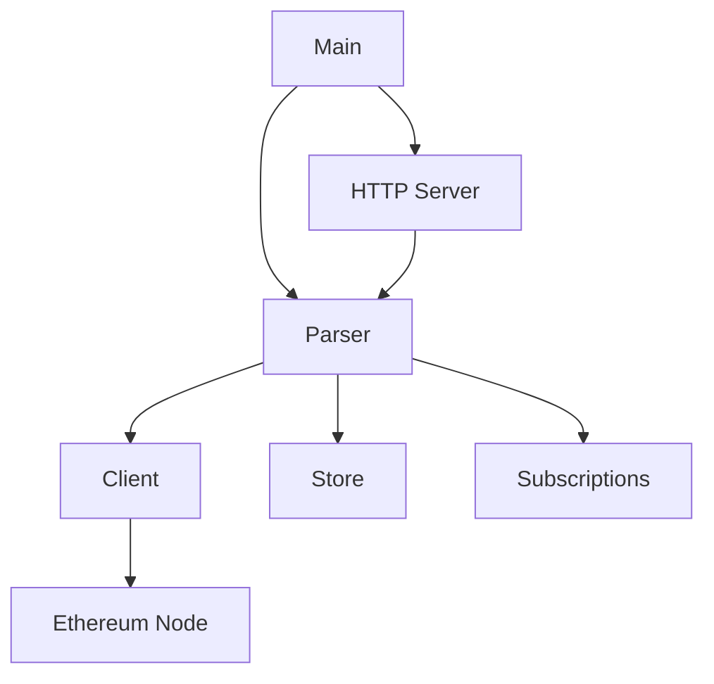
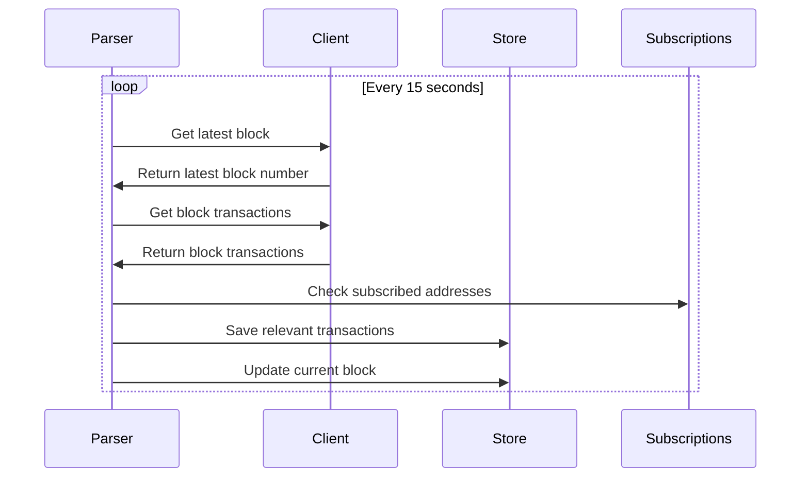
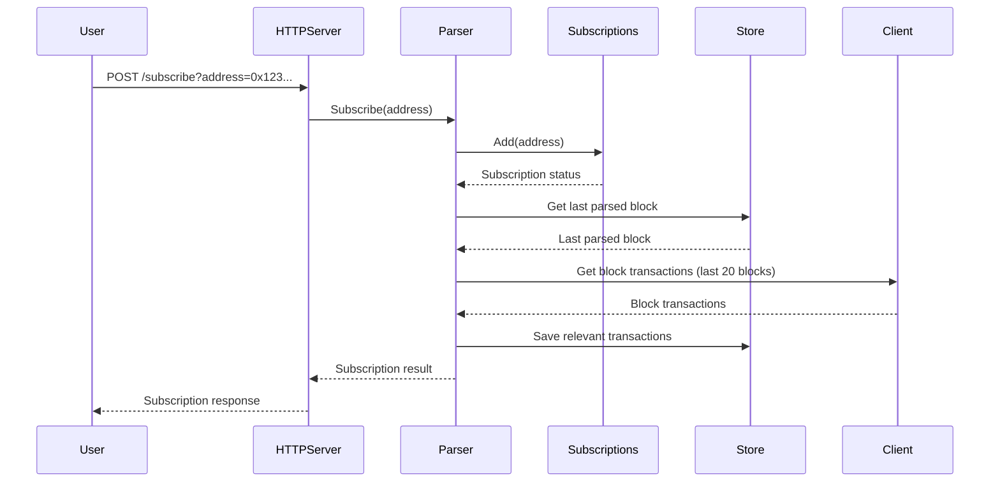
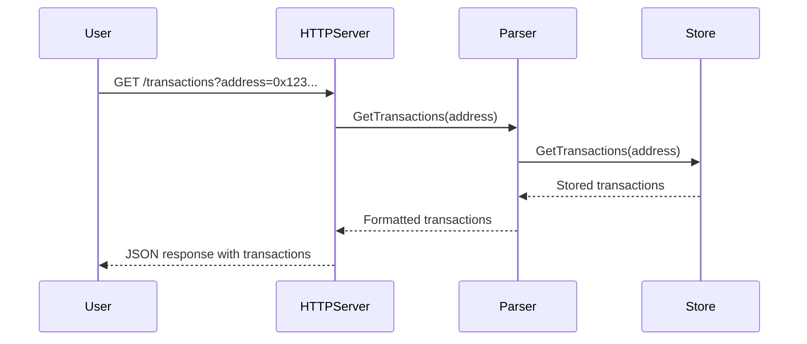

# Trust Wallet Backend Assignment

Simple Ethereum parser written in Go.

To run:

```bash
go run main.go
```

## Application Structure

The application consists of the following major components:



- **Main**: Entry point of the application, sets up the parser and HTTP server.
- **Parser**: Core component that manages the parsing of Ethereum blocks and transactions.
- **Client**: Handles communication with the Ethereum node.
- **Store**: Manages storage of parsed data.
- **Subscriptions**: Manages address subscriptions.
- **HTTP Server**: Provides API endpoints for interacting with the parser.

## Core Dataflows

### 1. Parsing New Blocks



This dataflow is non-blocking and runs in a separate goroutine. It utilizes concurrency to continuously parse new blocks without blocking other operations.

### 2. Subscribing to an Address



The subscription process is mostly blocking, but the backfilling of transactions runs in a separate goroutine to avoid blocking the HTTP response.

### 3. Retrieving Transactions for an Address



This dataflow is blocking as it needs to retrieve and return the data synchronously.

## Postman Collection

This project comes with a Postman collection that exercises the core dataflows.

## Concurrency and Parallelism

The application makes use of concurrency in several ways:

1. **Block Parsing**: The main parsing loop runs in a separate goroutine, allowing it to continuously check for new blocks without blocking the rest of the application.

2. **Subscription Backfilling**: When a new address is subscribed, the backfilling of past transactions runs in a separate goroutine to avoid blocking the HTTP response.

3. **HTTP Server**: The HTTP server runs in its own goroutine, allowing it to handle multiple requests concurrently.

The application doesn't make extensive use of parallelism, as most operations are I/O bound (either waiting for responses from the Ethereum node or database operations). However, the use of goroutines allows for concurrent handling of multiple tasks.

## Error Handling

The application uses the [error wrapping idiom introduced in Go 1.13](https://go.dev/blog/go1.13-errors). This allows for more detailed error information while preserving the original error context. For example:
This approach makes it easier to trace the source of errors and provide more meaningful error messages to users or in logs.

## Future Improvements

1. Redesign dataflows around channel-based concurrency to improve robustness, inspectability and performance.
2. Add support for websocket subscriptions for real-time updates.
3. Implement persistent storage instead of in-memory storage.
4. Add more comprehensive error handling and logging.
5. Implement rate limiting for the Ethereum node requests.
6. Add support for websocket subscriptions for real-time updates.
7. Implement pagination for transaction retrieval, general query param improvements.

## Testing

The project includes a basic end-to-end test in `main_test.go`.
You can run the test with `go test -v ./...`.

Things left undone regarding test coverage:

1. Add unit tests for individual components (Parser, Client, Store, etc.).
2. Implement integration tests that use a local Ethereum testnet.
3. Add more comprehensive end-to-end tests covering edge cases and error scenarios.

## Documentation

The project uses godoc for API documentation. To generate and view the documentation locally:

0. Install godoc if you haven't already: `go install golang.org/x/tools/cmd/godoc@latest`
1. Run `godoc -http=:6060`
2. Open a browser and navigate to `http://localhost:6060/pkg/github.com/keithagy/trust-wallet-blockchain-parser/`

## Deployment

In the spirit of keeping things simple and timeboxing the project, the application is not deployed to a cloud provider.
Future steps would include containerizing this application and declaratively providing it, along with required databases and network dependencies relating (e.g. to authentication), via Docker or as part of a Kubernetes cluster.
